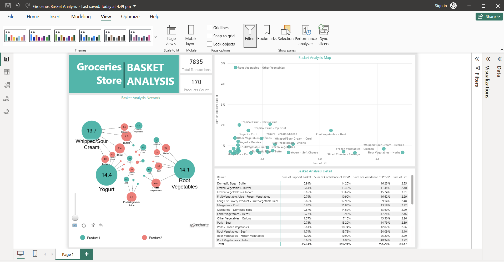
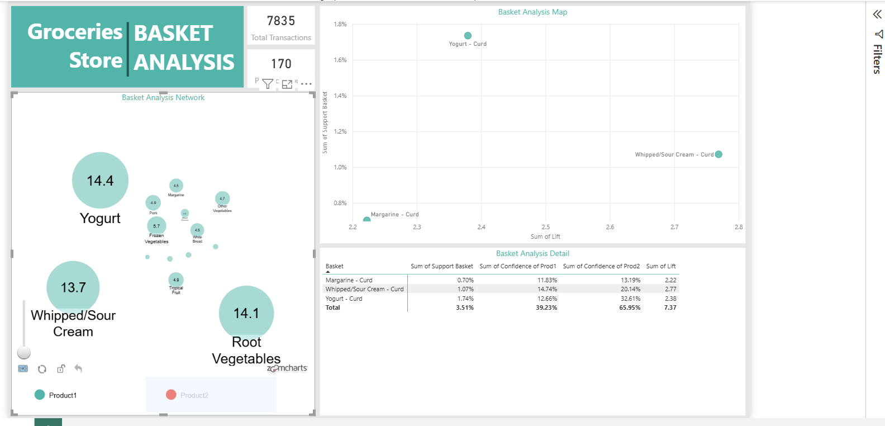
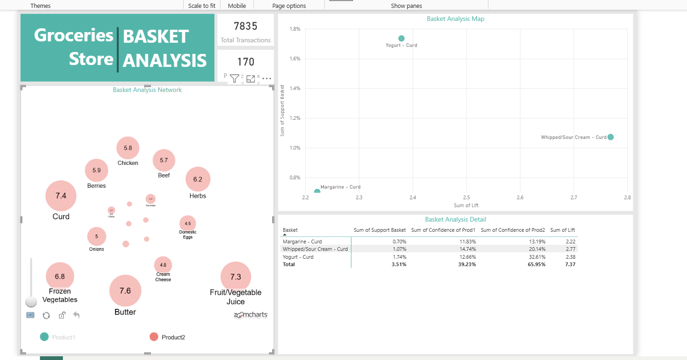

    # Market Basket Analysis (Power BI)

Brief one-liner about what this repo contains and why it’s useful.
> Example: Interactive Power BI report to discover items frequently bought together using association rules (support, confidence, lift).

## Preview

## Table of Contents
- [About](#about)
- [Files](#files)
- [How to Open](#how-to-open)
- [Notes on Data Source](#notes-on-data-source)
- [Features](#features)
- [Exports](#exports)
- [Attribution](#attribution)
- [License](#license)

## About
Write 3–4 lines describing the dataset and the problem.  
- What is Market Basket Analysis?
- What metrics you use (Support, Confidence, Lift).
- What decisions the dashboard helps with (promotions, placement, cross-sell).

## Files
- `Groceries Basket Analysis.pbix` – Power BI report.
- `assets/` – screenshots used in this README.
- `outputs/` *(optional)* – exported PDF/PowerPoint.

## How to Open
1. Clone/download this repo.
2. Open `Groceries Basket Analysis.pbix` in **Power BI Desktop**.
3. If prompted for data paths, see **Notes on Data Source** below.

## Notes on Data Source
If the report references local files:
- In Power BI: **Home → Transform data → Data source settings → Change Source**  
- Point to your CSV/Excel/DB path. Click **Apply changes**.

## Features
- Association rules ranked by **Support**, **Confidence**, and **Lift**
- Interactive visuals: network, scatter, tables, slicers
- Quick filtering by product/category/date

## Exports
- Static PDF: `outputs/MBA-report.pdf` *(add/link if available)*
- (Optional) Interactive web link if published to Power BI Service:
  - ▶️ **[Open interactive report](https://app.powerbi.com/view?r=YOUR_LINK_HERE)**

## Attribution
If this work is based on another repository or dataset, credit it here.

## License
MIT — see [`LICENSE`](LICENSE).
